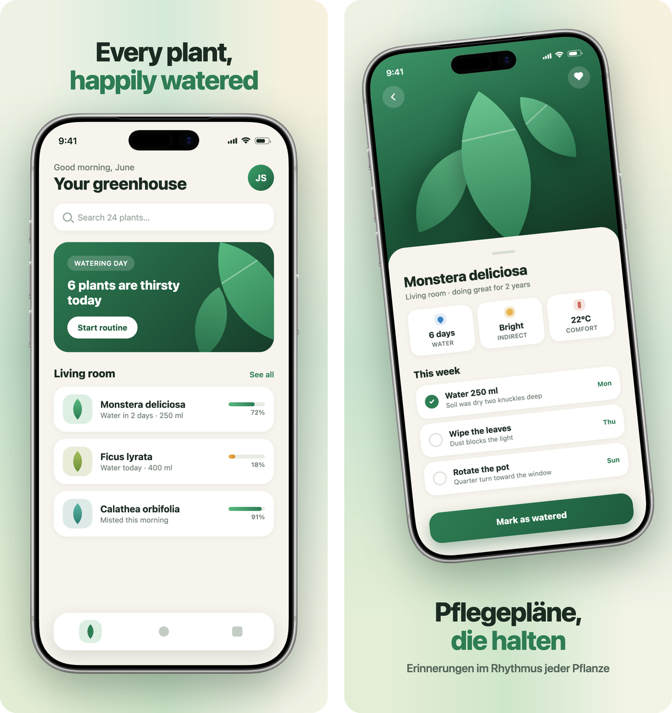
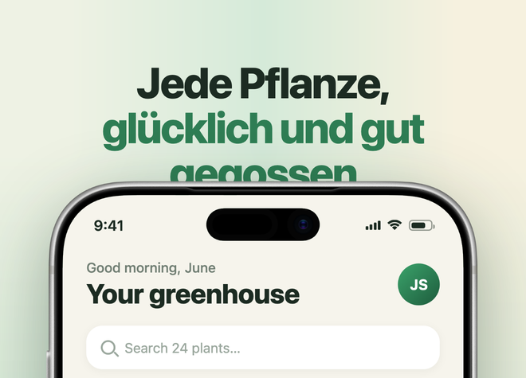
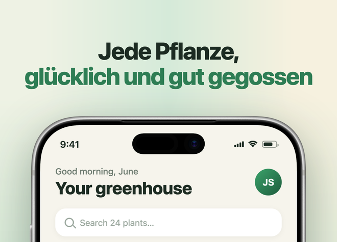

# appshot-studio

Interactive, config-driven App Store screenshot tool, written in Swift. It frames your real app screenshots inside real device bezels, puts a localized marketing caption on top of a generated background, and writes store-ready PNGs — one per locale per slot. Layouts are plain HTML/CSS rasterized by headless Chrome, so anything CSS can do, your screenshots can do.



*Both images above are straight `appshot render` output for the bundled demo app — the two shipped templates (`caption-top`, and `caption-bottom` with a subtitle), English and German, flat and tilted.*

## Why not frameit / a design tool / a SaaS?

- **fastlane frameit** composites flat images with rigid typography — no tilt, no gradients, no layout freedom.
- **Design tools** don't scale: 6 slots × 18 locales is 108 artboards to keep in sync by hand.
- **Screenshot SaaS** is a subscription for something this repo does in a few hundred lines of Swift you can read.

Everything that makes your shots *yours* — device, fonts, colors, background, layout, locales, captions — lives in `apps/<app>/`. The tool itself never changes per app.

## Requirements

- macOS 13 or later
- Google Chrome or any Chromium (auto-detected; override with `--chrome PATH` or `$CHROME`)
- Swift 5.10+ (Xcode 15.3+) — only to run from a clone or build from source; the Homebrew install needs neither

## Quick start

```bash
brew install jems19s/tap/appshot
mkdir my-screenshots && cd my-screenshots
appshot init
```

Homebrew installs the prebuilt universal binary (Apple silicon and Intel) from the GitHub release — no Xcode needed. The binary is self-contained — running `appshot init` in an empty directory bootstraps a fresh studio (`apps/`, `templates/`, `devices/`).

`init` interviews you — device (fetched live, arrow-key select), colors, output size, your screenshots folder, locales, captions, theme — then writes `apps/<name>/` and offers to render on the spot. **Esc goes back a step** (previous answers are kept as defaults); in plain pipes use `0` on menus and `<` on text prompts. Every answer lands in `config.json`, so from then on iteration is *edit the file, re-run*:

```bash
appshot render                                 # everything
appshot render --locale en --slot 01-home      # while iterating
```

`--app` is only needed once `apps/` holds more than one app.

### Without the wizard

For scripts, CI and coding agents, `--name` skips the questions and takes every answer from options:

```bash
appshot init --name myapp --device "iPhone 17 Pro Max" --screenshots ./screens \
  --locale en-US --locale de-DE \
  --caption 'Every plant,\n*happily watered*' --caption 'Care plans *that stick*'
appshot render
```

`--device` is fetched when it isn't installed yet. Optional: `--color` (default: the pack's default), `--size WIDTHxHEIGHT` (default: the App Store size for the device), repeatable `--locale` (default `en`) and `--caption` (one per screenshot, in file name order; the rest start empty), and `--overwrite` to replace an existing app's config. Theme and background start from the wizard's defaults — edit `config.json`. If the wizard's input runs out before it finishes, it stops with an error instead of waiting for an answer.

### With a coding agent

appshot ships a skill for AI coding agents (Claude Code, Cursor, Codex and others that read [Agent Skills](https://skills.sh)): it teaches the agent the whole flow — find the raw screenshots, set up the app without the wizard, write and translate captions, style, render and check every image.

```bash
npx skills add jems19s/appshot-studio
```

Add `-g` to install it for all your projects. Then ask your agent for App Store screenshots. The skill lives in [`skills/appshot/`](skills/appshot/SKILL.md) if you'd rather copy it by hand (for Claude Code: `~/.claude/skills/appshot/`).

### From a clone

Try the bundled demo:

```bash
git clone https://github.com/jems19s/appshot-studio && cd appshot-studio
swift run appshot devices fetch "iPhone 17 Pro Max"
swift run appshot render        # → output/demo/<locale>/<slot>.png, 1320×2868
```

To build the command from source instead of Homebrew: `swift build -c release && sudo cp .build/release/appshot /usr/local/bin/`.

## Commands

| Command | What it does |
| --- | --- |
| `appshot init` | interactive wizard, or `--name` with options to skip it — scaffolds `apps/<name>/` (config, captions, assets) |
| `appshot render` | renders `apps/<app>/` → `output/<app>/<locale>/<slot>.png`; `--app` (optional when `apps/` holds one app), repeatable `--locale`/`--slot`, `--chrome`, `--root` |
| `appshot devices` | installed packs; `devices list` = every frame upstream; `devices fetch "<name>"` downloads + measures a pack (`--colors`, `--id`) |

All commands take `--root` (defaults to the current directory) — the folder holding `apps/`, `templates/`, `devices/`, `output/`.

## How it works

For every locale × slot, the tool fills `templates/<template>.html` with values from your config, the locale's caption fields, and `file://` paths to the background, screenshot, bezel and mask — then screenshots the page with headless Chrome at exactly `output.width × output.height`. Backgrounds are generated in pure Swift. The screenshot is clipped by the device pack's `hole-mask.png`, so square corners never poke past the bezel's rounded ones.

```
Sources/appshot/                 the tool — you never edit it per app
templates/<name>.html            one file = one screenshot layout ({{token}} placeholders)
devices/<id>/                    device packs (fetched by `appshot devices fetch`, gitignored)
apps/<app>/config.json           everything about your app's set
apps/<app>/captions/<locale>.json  localized caption text
apps/<app>/assets/               your real app screenshots
output/<app>/<locale>/<slot>.png results
```

## config.json

Written by `appshot init`, edited by you afterwards.

| Key | Meaning |
| --- | --- |
| `device` / `deviceColor` | device pack id under `devices/` and a color from its `device.json` |
| `output` | canvas size in px — use the store's required size |
| `layout.deviceWidth` | rendered device width in px |
| `layout.deviceTop` | device y-offset in px (default parks it near the bottom). Go negative to crop the device at the top edge, or push it past the canvas height to crop at the bottom |
| `layout.deviceLeft` | device x-offset in px (default: centered). Negative / large values crop the device at the left / right edge |
| `fonts` | optional — omit it to use the system font stack. `{family, dir, faces:[{weight, style?, file}], localeFallbacks:{locale: family}}`; `dir` is absolute or relative to the app folder, faces are `@font-face`d from your own TTF/OTFs |
| `locales` | list of locale codes; each needs `captions/<locale>.json` |
| `theme` | styling tokens, injected into templates as `{{THEME.<key>}}` (defaults below) |
| `background` | see background types |
| `slots` | ordered shots: `{name, template, screenshot, tilt, caption}` — `name` is the output filename, `caption` the key in the captions file. A slot may also set its own `deviceWidth`/`deviceTop`/`deviceLeft` to override `layout` for just that shot — e.g. render a tilted device smaller so its rotated corners stay inside the canvas (the demo's second slot does exactly this), or crop one shot's device at a different edge |

### theme defaults

```
accent #4f7df9 · headlineColor #181a20 · captionTop 150px · captionBottom 150px
captionPadding 0 90px · captionSize 108px · captionWeight 800 · captionLineHeight 1.05
captionLetterSpacing -0.03em · subtitleSize 46px · subtitleWeight 600
subtitleColor #4b5563 · deviceShadow 0 56px 90px rgba(10,12,24,.4)
captionFit none · captionMinScale 70% · captionFitGap 40px   (see Captions › Auto-fit)
```

Any key you set in `theme` overrides the default; any extra key you invent is injected too, so a template can use `{{THEME.whatever}}`.

### background types

- `mesh` — `colors`: 9 hex values on a 3×3 grid, bilinearly interpolated (`scale`, `blur` optional)
- `solid` — `color`
- `linear` — `stops` list + `angle` (90 = top→bottom)
- `image` — `file`: a ready-made PNG in `assets/`

## Captions

```json
{
  "home": { "title": "Every plant,\n*happily watered*" },
  "care": { "title": "Care plans\n*that stick*", "subtitle": "Reminders that match each plant's rhythm" }
}
```

`*…*` wraps the accent span (colored `THEME.accent`), `\n` breaks the line. A plain string is shorthand for `{"title": …}`. Both shipped templates render an optional **`subtitle`** under the title (styled by the `subtitle*` theme keys); leave it out and no space is reserved. Every field is injected as `{{cap.<key>}}` and unused ones are stripped — adding yet another text field to your layout is a template edit plus the localized words, never a tool change.

### Auto-fit

A caption that fits in English can run into the device in German. Turn on auto-fit and every locale × slot is checked on its own:

```json
"theme": { "captionFit": "shrink" }
```

When a caption comes closer than `captionFitGap` (40px) to the device — tilted devices included — title and subtitle shrink together, re-wrapping as they go, until it clears; captions that already fit are left untouched. They never go below `captionMinScale` (70%) of their themed size: a caption that still collides there is rendered at that floor, and `render` prints a warning naming the app, locale and slot. Auto-fit is off by default.

<p>
  
  
</p>

*The demo's German home shot with auto-fit off and on: the caption drops to 87% and re-wraps onto two lines; nothing else moves.*

Auto-fit is a short script at the end of both shipped templates, which a custom template can copy. Studios bootstrapped by appshot 1.0 keep their older `templates/caption-*.html` without it — `render` warns about them; replace them with the current files from this repository's `templates/`.

## Localization

- One `captions/<locale>.json` per locale (`init` scaffolds them all from your primary locale).
- **Per-locale screenshots:** `assets/<locale>/<file>` wins over `assets/<file>`. Ship localized app chrome per storefront by dropping localized captures into the locale subfolder; everything else falls back to the shared file.
- `fonts.localeFallbacks` appends a per-locale family to the font stack (CJK, Thai, …).

## Devices

```bash
swift run appshot devices                                  # what's installed
swift run appshot devices list                             # every frame upstream
swift run appshot devices fetch "iPad Pro (11-inch)" --colors silver
```

`fetch` matches whole words and takes only that model's colors — `"iPhone 17"` leaves out the 17 Pro and 17 Pro Max. A name that matches nothing, or several devices, lists the candidates instead. The pack lands in `devices/` only once it is complete.

Frames are downloaded from [fastlane/frameit-frames](https://github.com/fastlane/frameit-frames) — Apple's official marketing product images. The screen cutout is measured automatically (the alpha channel is flood-filled from the canvas corners; the transparent region not reachable from outside is the screen hole) and written to `device.json`, together with `hole-mask.png` — the exact hole silhouette used to clip your screenshot to the bezel's rounded corners.

A device pack is just a folder, so you can also build one by hand from your own bezel art:

```
devices/<id>/device.json    {"frameSize":[W,H], "screen":[x,y,w,h], "mask":"hole-mask.png",
                             "colors":{"slug":"frame-slug.png"}, "default":"slug"}
devices/<id>/frame-*.png    bezel art with a transparent screen cutout
devices/<id>/hole-mask.png  alpha 255 inside the screen hole, 0 elsewhere
```

## Templates

A template is one screenshot layout. Two ship with the tool:

- **`caption-top`** — caption at the top (`THEME.captionTop`), device below; crop the device at the canvas bottom by pushing `deviceTop` down, or show it whole like the demo.
- **`caption-bottom`** — device at the top, caption anchored to the bottom (`THEME.captionBottom`).

The tool replaces `{{W}} {{H}} {{FONT_FACES}} {{FONT_STACK}} {{BG_IMG}} {{FRAME}} {{MASK}} {{SCREEN}} {{TILT}} {{DEV_W}} {{DEV_H}} {{DEV_TOP}} {{DEV_LEFT}} {{SX}} {{SY}} {{SW}} {{SH}}`, every `{{THEME.<key>}}` and every `{{cap.<key>}}`, and fails loudly if a token is left unfilled. Add `templates/<name>.html` and reference it from a slot to get another layout (split, panorama, no-device, …).

## Store sizes

Set `output` to what the store requires — e.g. 1320×2868 for the current iPhone 6.9″ portrait requirement (Apple derives the smaller sizes), 2048×2732 for 13″ iPad — and pick a device pack that matches the aspect. `init` suggests these automatically.

## CI

`.github/workflows/render-demo.yml` builds the tool, runs the unit tests, fetches a device pack and renders the demo on every push (GitHub's macOS runners ship Xcode and Chrome). Run the tests locally with `swift test` (Xcode 16+). Extra Chrome switches go in `$CHROME_FLAGS`.

## Troubleshooting

**macOS says "'Terminal' was prevented from modifying apps on your Mac."** Harmless, and not appshot writing anything: launching Chrome can wake Google's auto-updater, which tries to update Chrome's own app bundle; macOS App Management blocks that and attributes it to the terminal that spawned Chrome. Your renders are unaffected — dismiss it, and don't grant Terminal the App Management permission on appshot's account. To never see it, render with a browser that has no auto-updater — Chromium or [Chrome for Testing](https://developer.chrome.com/blog/chrome-for-testing/) — via `--chrome PATH` or `$CHROME`.

## License

MIT — see [LICENSE](LICENSE). Device frame art is not part of this repository: `appshot devices fetch` downloads it from fastlane/frameit-frames at usage time, and it remains Apple's marketing material, subject to [Apple's marketing guidelines](https://developer.apple.com/app-store/marketing/guidelines/). The demo "app" is fictional — its screens were themselves generated with headless Chrome from `apps/demo/screens/*.html` (`--window-size=1320,2868`).
